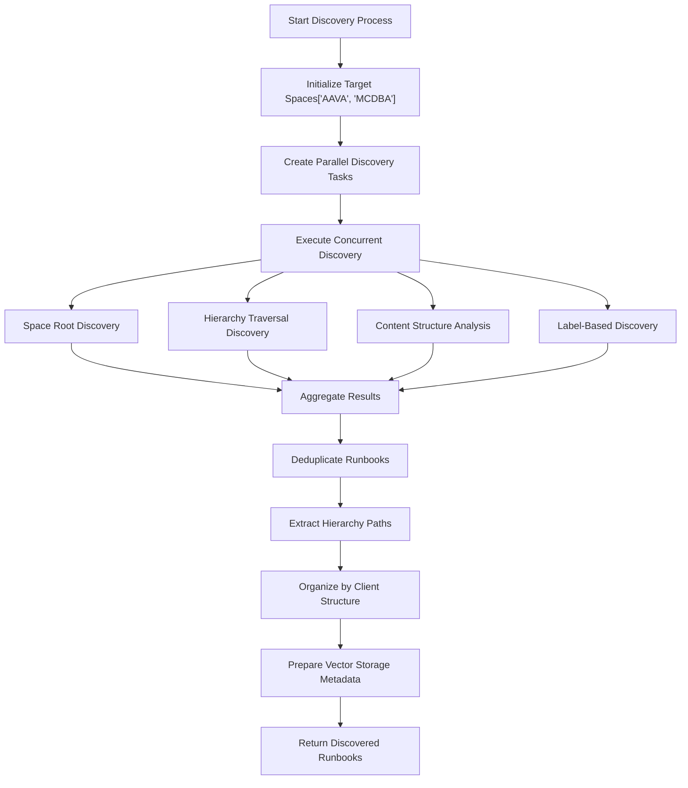
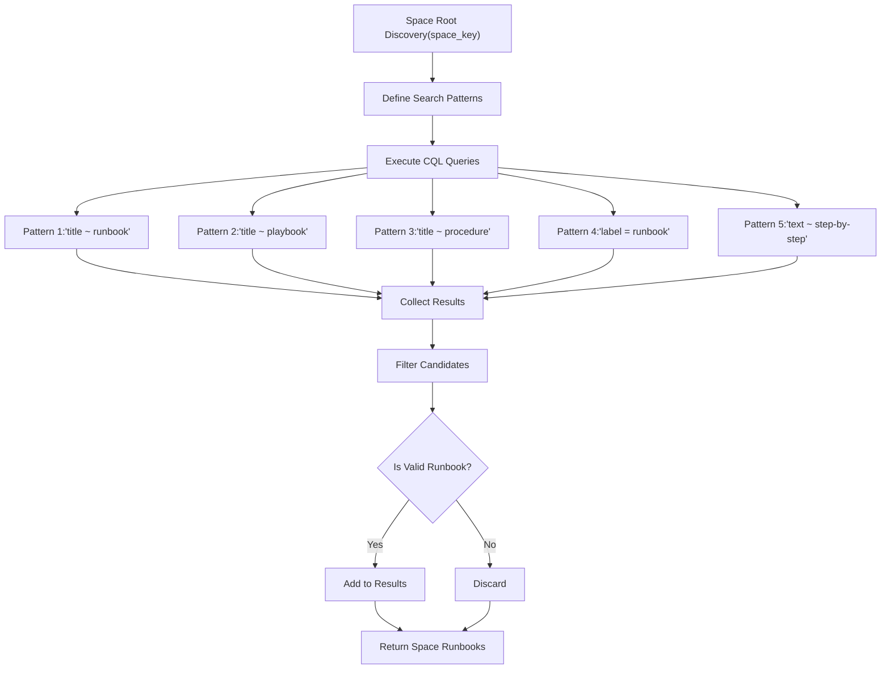
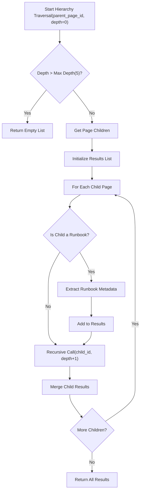
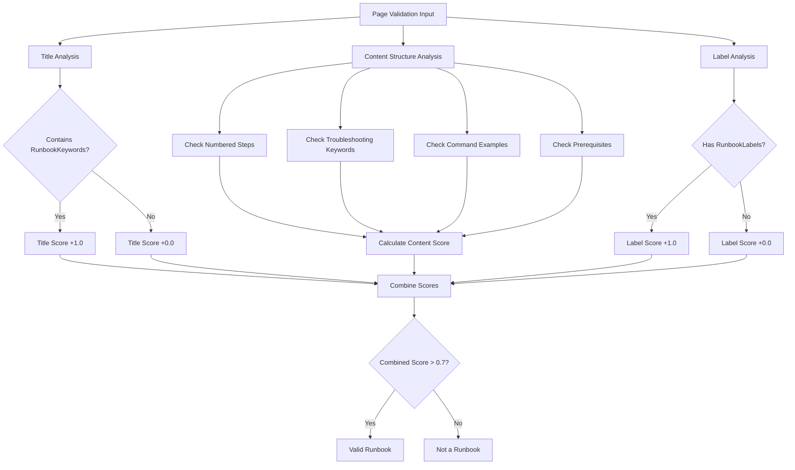

# Confluence Runbook Discovery Algorithm Flowchart

Based on the hierarchical discovery strategy discussed, here's the comprehensive flowchart for the runbook discovery algorithm:

## Main Discovery Flow



## Detailed Space Root Discovery



## Hierarchy Traversal Algorithm



## Runbook Validation Process



## Content Structure Analysis Detail

```mermaid
flowchart TD
    A["Content Analysis(page_content)"] --> B["Initialize Score = 0.0"]
    
    B --> C["Check Numbered StepsRegex: '\\d+\\.\\s+'"]
    C --> D{"Found?"}
    D -->|Yes| E["Score += 0.3"]
    D -->|No| F["Continue"]
    
    E --> G["Check Troubleshooting Keywords"]
    F --> G
    G --> H["Count Keyword Matches['error', 'issue', 'problem', 'solution']"]
    H --> I["Score += min(matches * 0.1, 0.3)"]
    
    I --> J["Check Code BlocksRegex: '```
    J --> K{"Found?"}
    K -->|Yes| L["Score += 0.2"]
    K -->|No| M["Continue"]
    
    L --> N["Check PrerequisitesRegex: 'prerequisite|requirement'"]
    M --> N
    N --> O{"Found?"}
    O -->|Yes| P["Score += 0.2"]
    O -->|No| Q["Final Score"]
    
    P --> R["Return min(score, 1.0)"]
    Q --> R
```

## Hierarchy Path Construction

```
flowchart TD
    A["Build Hierarchy Path(page)"] --> B["Initialize Path Components[]"]
    B --> C["Set Current Page = Input Page"]
    
    C --> D["Add Page Title to Components"]
    D --> E{"Has ParentAncestors?"}
    E -->|Yes| F["Get Parent Page ID"]
    E -->|No| G["Add Space Key"]
    
    F --> H["Fetch Parent Page"]
    H --> I["Set Current Page = Parent"]
    I --> D
    
    G --> J["Reverse Components Order(Root to Leaf)"]
    J --> K["Join with '/' Separator"]
    K --> L["Return Full Hierarchy Path'SPACE/Parent/Child/Page'"]
```

## Parallel Processing Architecture

```
flowchart TD
    A["Parallel Discovery Orchestrator"] --> B["Create Task Groups"]
    
    B --> C["Space AAVA Tasks"]
    B --> D["Space MCDBA Tasks"]
    
    C --> E["AAVA Root Discovery"]
    C --> F["AAVA Hierarchy Traversal"]
    C --> G["AAVA Content Analysis"]
    C --> H["AAVA Label Discovery"]
    
    D --> I["MCDBA Root Discovery"]
    D --> J["MCDBA Hierarchy Traversal"]
    D --> K["MCDBA Content Analysis"]
    D --> L["MCDBA Label Discovery"]
    
    E --> M["asyncio.gather()"]
    F --> M
    G --> M
    H --> M
    I --> M
    J --> M
    K --> M
    L --> M
    
    M --> N["Process Results"]
    N --> O["Handle Exceptions"]
    O --> P["Aggregate Valid Results"]
    P --> Q["Return Combined Runbooks"]
```

## Client Organization Flow

```
flowchart TD
    A["Organize by Client Hierarchy(runbooks[])"] --> B["Initialize Client Structure"]
    
    B --> C["For Each Runbook"]
    C --> D["Extract Client from Path"]
    D --> E{"Client Type?"}
    
    E -->|Helvetia| F["Add to client_specific['helvetia']"]
    E -->|Bravida| G["Add to client_specific['bravida']"]
    E -->|Neste| H["Add to client_specific['neste']"]
    E -->|Grohe| I["Add to client_specific['grohe']"]
    E -->|General| J["Add to general[]"]
    
    F --> K{"More Runbooks?"}
    G --> K
    H --> K
    I --> K
    J --> K
    
    K -->|Yes| C
    K -->|No| L["Return Organized Structure"]
```

## Vector Storage Preparation

```
flowchart TD
    A["Prepare for Vector Storage(runbook_data)"] --> B["Extract Core Content"]
    B --> C["Combine Title + Content"]
    C --> D["Build Metadata Object"]
    
    D --> E["Add Hierarchy Path"]
    D --> F["Add Client Information"]
    D --> G["Add Depth Level"]
    D --> H["Add Parent Pages"]
    D --> I["Add Discovery Method"]
    D --> J["Add Confidence Score"]
    D --> K["Add Confluence URL"]
    
    E --> L["Create Vector Storage Document"]
    F --> L
    G --> L
    H --> L
    I --> L
    J --> L
    K --> L
    
    L --> M["Return Formatted Document{id, content, metadata}"]
```

## Performance Optimization Flow

```
flowchart TD
    A["Cache Manager Check"] --> B{"Cache Hit?"}
    B -->|Yes| C["Return Cached Data"]
    B -->|No| D["Execute API Call"]
    
    D --> E["Store in Cache(data, timestamp)"]
    E --> F["Return Fresh Data"]
    
    C --> G["Check TTL Validity"]
    G --> H{"Cache Still Valid?"}
    H -->|Yes| I["Use Cached Data"]
    H -->|No| J["Refresh Cache"]
    
    J --> D
    F --> K["Continue Processing"]
    I --> K
```

This comprehensive flowchart system provides a complete view of the hierarchical runbook discovery algorithm, showing how it handles multi-level traversal, content validation, client organization, and performance optimization while maintaining the full Confluence hierarchy structure for the db_runbook_finder system.